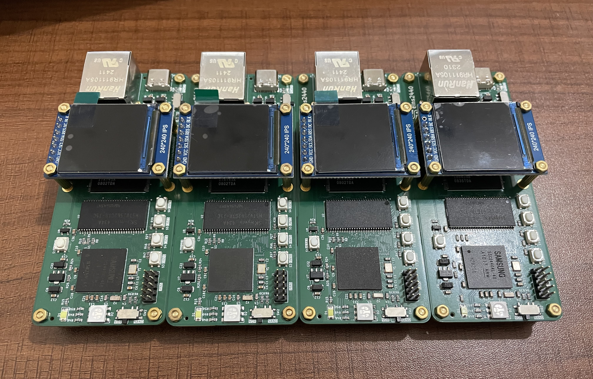
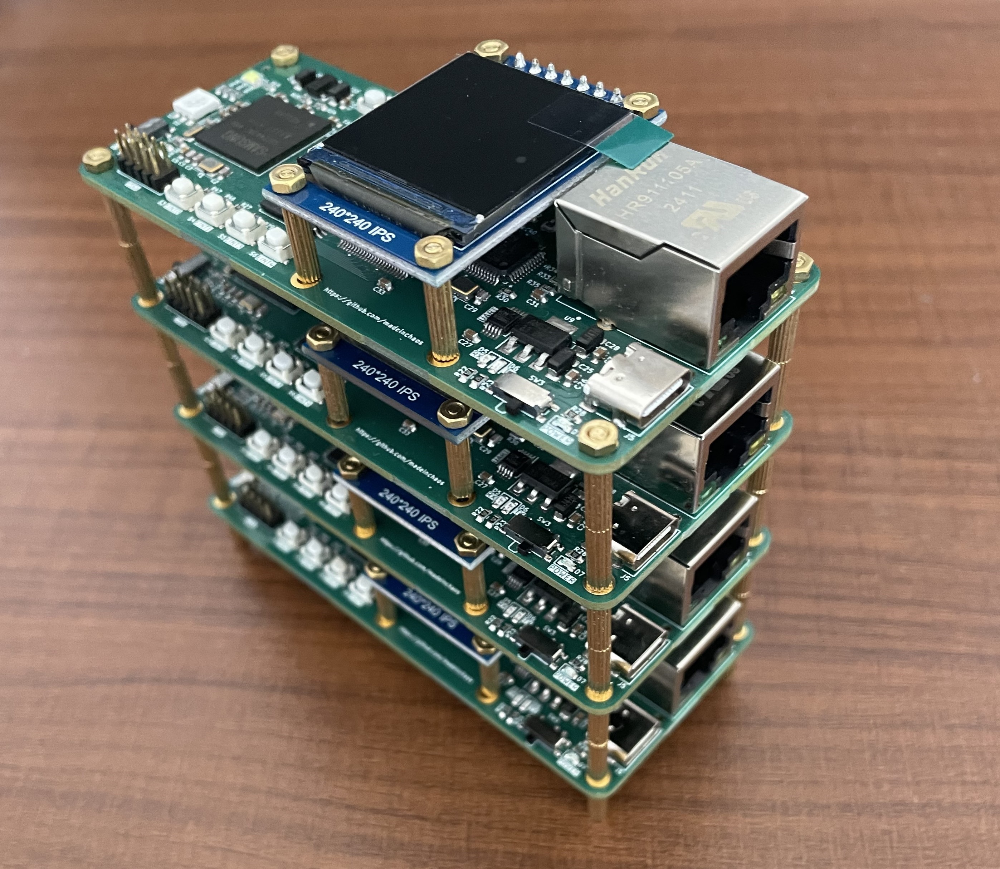

# EINS2440

This project provides a complete hardware and software solution based on the S3C2440 ARM9 processor.  
It includes KiCad schematics and PCB designs, as well as U-Boot, Linux kernel, and root filesystem ports.

## Directory
- **hardware**: KiCad schematics and PCB design for the eins2440 board.
- **software**: Ported U-Boot, Linux kernel, root filesystem and others.

