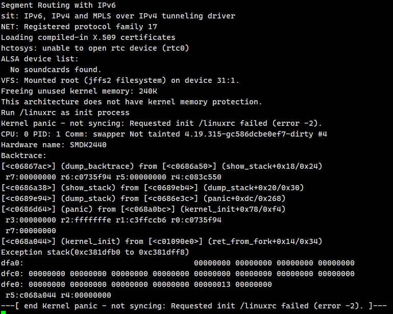

# Build the kernel

## Build

Download the kernel from: https://www.kernel.org/  
Version: linux-4.19.315

### Modify and Compile

TODO

## Download the zImage to the eins2440 using the TFTP

Download TFTP tool from: [https://bitbucket.org/phjounin/tftpd64/downloads/](https://bitbucket.org/phjounin/tftpd64/downloads/)  
Version: tftpd64.464.zip

**Ensure eins2440 and TFTP server in the same local network.**

Set up the TFTP server as shown below. Current Directory where is the location of the zImage.


Setting U-Boot environment variables:

```sh
# fill in your address
setenv gatewayip 192.168.0.1
# fill in your address
setenv netmask 255.255.255.0
# eins2440 address, fill in your address
setenv ipaddr 192.168.0.117
# address of the TFTP server, fill in your address
setenv serverip 192.168.0.108

setenv mtdids nand0=nand

# set nandflash partitions
# two partitions, a kernel partition of 5M size and the rest space for the root filesystem
setenv mtdparts 'mtdparts=nand:5m(kernel),-(root)'

setenv machid 16a

setenv bootargs 'noinitrd root=/dev/mtdblock1 rootfstype=jffs2 rw init=/linuxrc console=ttySAC0,115200'

# turn off all LEDs
# read 5M data from NAND flash address 0 to SDRAM address 30008000
# boot the zImage
setenv bootcmd 'led all off; nand read 30008000 0 500000 && bootz 30008000'

saveenv
```

Finally, download the kernel:
```sh
# download zImage to SDRAM address 30000000
# erase NAND flash kernel partition
# write data from SDRAM address 30000000 to NAND flash kernel partition, 5M size
# reboot
tftp 30000000 zImage && nand erase.part kernel && nand write 30000000 kernel 500000 && reset
```

If you see the following log in the serial console, it means the kernel has started. But there is no root file system.


Now you can proceed to create the root file system, Please refer to rootfs README.md.