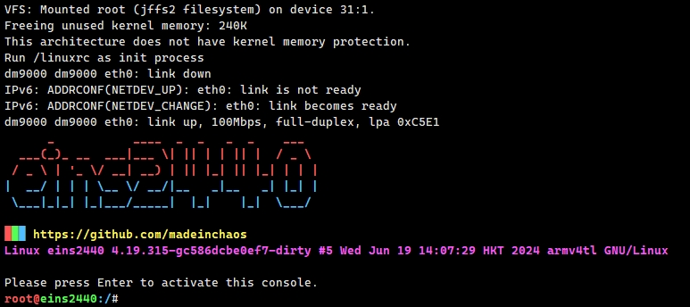

# Build the root file system

## Build

Download the busybox from: https://www.busybox.net/downloads/  
Version: busybox-1.35.0

### Modify and Compile

TODO

## Download the rootfs.jffs2 to the eins2440 using the TFTP
**You must download the kernel before you download the root file system.**  
**Please refer to documentation kernel README.md**
```sh
# download root.jffs2 to SDRAM address 30000000
# erase nandflash root partition
# write data from SDRAM address 30000000 to NAND flash root partition, 5M size
# reboot
tftp 30000000 root.jffs2 && nand erase.part root && nand write 30000000 root 500000 && reset
```

If the following screen is displayed after restarting, congratulations, it means that the system has successfully started.
