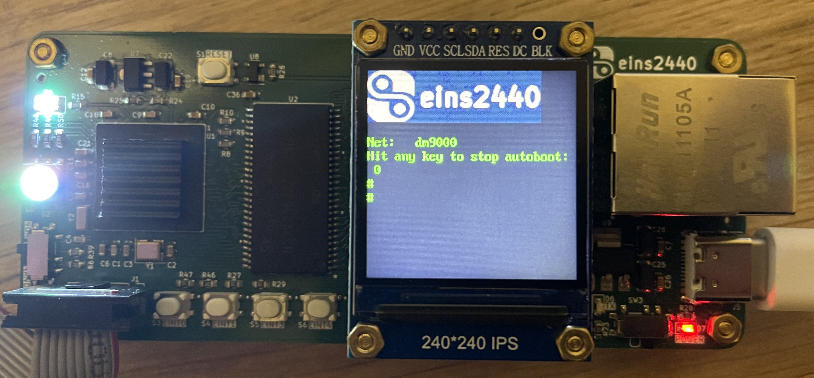

# Porting u-boot-2016.11 to the board eins2440

## Setup the environment

The GCC version should be the same year as the u-boot version, otherwise some unexpected errors may occur.

The older versions of the GCC can be downloaded from [Linaro website](https://releases.linaro.org/components/toolchain/binaries/).
```
$ wget https://releases.linaro.org/components/toolchain/binaries/4.9-2016.02/arm-linux-gnueabi/gcc-linaro-4.9-2016.02-x86_64_arm-linux-gnueabi.tar.xz
$ tar xvf gcc-linaro-4.9-2016.02-x86_64_arm-linux-gnueabi.tar.xz
```

Replace $YOUR_PATH with your own directory
```
$ export PATH=$PATH:$YOUR_PATH/gcc-linaro-4.9-2016.02-x86_64_arm-linux-gnueabi/bin
$ export LD_LIBRARY_PATH=$LD_LIBRARY_PATH:$YOUR_PATH/gcc-linaro-4.9-2016.02-x86_64_arm-linux-gnueabi/lib
```

### Check the version
```
$ arm-linux-gnueabi-gcc --version

arm-linux-gnueabi-gcc (Linaro GCC 4.9-2016.02) 4.9.4 20151028 (prerelease)
Copyright (C) 2015 Free Software Foundation, Inc.
This is free software; see the source for copying conditions.  There is NO
warranty; not even for MERCHANTABILITY or FITNESS FOR A PARTICULAR PURPOSE.
```

## Get the u-boot source code
```
$ wget https://ftp.denx.de/pub/u-boot/u-boot-2016.11.tar.bz2
$ tar xvf u-boot-2016.11.tar.bz2
```

## Patch 0001-port.patch and compile
```
$ cp 0001-port.patch ./u-boot-2016.11
$ cd ./u-boot-2016.11
$ git apply 0001-port.patch

$ make eins2440_defconfig
$ make ARCH=arm CROSS_COMPILE=arm-linux-gnueabi- -j6
```

After compiling, you can download u-boot.bin to eins2440 using jlink.
Once the download is complete and reboot, you should see the following screen.


## Examples of u-boot commands

Miscellaneous
```
# bdinfo
arch_number = 0x000000C1
boot_params = 0x30000100
DRAM bank   = 0x00000000
-> start    = 0x30000000
-> size     = 0x04000000
eth0name    = dm9000
ethaddr     = 08:00:3e:26:0a:5b
current eth = dm9000
ip_addr     = 10.10.10.155
baudrate    = 115200 bps
TLB addr    = 0x33FF0000
relocaddr   = 0x33F1F000
reloc off   = 0x33F1F000
irq_sp      = 0x33B0EEF0
sp start    = 0x33B0EEE0
FB base     = 0x33FD3000

# version

U-Boot 2016.11 (May 19 2024 - 21:55:54 +0800)
arm-linux-gnueabi-gcc (Linaro GCC 4.9-2016.02) 4.9.4 20151028 (prerelease)
GNU ld (GNU Binutils for Ubuntu) 2.38

# bootz 30008000
# bootm 30008000
# reset
```

Norflash
```
# flinfo

Bank # 1: EON EN29LV160AB flash (16 x 16)  Size: 2 MB in 35 Sectors
  AMD Legacy command set, Manufacturer ID: 0x1C, Device ID: 0x2249
  Erase timeout: 30000 ms, write timeout: 100 ms

  Sector Start Addresses:
  00000000   RO   00004000   RO   00006000   RO   00008000   RO   00010000   RO 
  00020000   RO   00030000   RO   00040000   RO   00050000   RO   00060000   RO 
  00070000   RO   00080000        00090000        000A0000        000B0000      
  000C0000        000D0000        000E0000        000F0000        00100000      
  00110000        00120000        00130000        00140000        00150000      
  00160000        00170000        00180000   RO   00190000        001A0000      
  001B0000        001C0000        001D0000        001E0000        001F0000  

# erase 1a0000 1affff
# erase 1a0000 +10000
# erase 1:2-3
# protect on 1a0000 1affff
Protected 1 sectors
# cp.b 180000 1a0000 f0
Copy to Flash... Can't write to protected Flash sectors
# protect off 1a0000 1affff
```

Nandflash
```
# nand info

Device 0: nand0, sector size 128 KiB
  Page size       2048 b
  OOB size          64 b
  Erase size    131072 b
  subpagesize      512 b
  options     0x    1008
  bbt options 0x    8000

# nand read 30008000 200000 300000  /* 30008000(sdram addr), 200000(nand flash addr) */
# nand write 30008000 200000 300000 /* 30008000(sdram addr), 200000(nand flash addr) */
```

Memory operation
```
# md.b 30008000 f0
# cp.b 30000000 31000000 f0
```

LED control
```
# led all off
# led 0 on
# led 1 toggle
```

LCD
```
# lcdputs "hello world!"
```

Network
```
# ping 192.168.0.1
# dhcp 30008000 zImage.bin
# tftp 30008000 zImage.bin
# nfs 30008000 192.168.1.107:/home/linux/nfs/zImage
# tftpboot 30008000 192.168.1.107:/zImage
```

Environment variable
```
# print
# env set ipaddr 192.168.0.112
# setenv serverip 192.168.0.102
# env save
# saveenv
# setenv test delete
# setenv test 
# editenv bootcmd
edit: nand read 30008000 200000 300000;bootz 30008000 /* multiple commands */
```